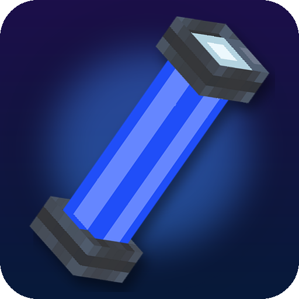

<p align="center">
  
</p>

<h1 align="center">Neon Glowsticks</h1>

<p align="center">
  Throwable glowsticks that bounce, roll and light up the dark with colored light.
</p>

<p align="center">
  
  <a href="https://neoforged.net"></a>
  
</p>

## Features

- **Four glowsticks** — red, green, blue and white, with 3D models in hand and on the ground.
- **Throw them** — *Use* cracks a glowstick and throws it; *Sneak* + *Use* drops it at your feet.
  Dispensers shoot glowsticks too.
- **Real physics** — glowsticks tumble through the air, bounce off walls, floors and mobs, roll when they hit the
  ground sideways and settle lying flat on one of their sides. They sink slowly in water and drift with the current.
- **Real light** — a thrown glowstick lights up the area around it (light level 13 by default) and the light follows
  it while it flies, rolls or sinks. Works under water as well. Mobs don't spawn in the lit area.
- **Colored light** — the blocks around a glowstick are tinted with its color, fading with distance and only where
  the stick can actually see them, so walls cast colored shadows. A soft halo glows around the stick itself.
- **Burns out** — a glowstick glows for 10 minutes, dims during the last minute and goes out with a puff of smoke.
- **Pick it back up** — right-click a glowstick in the world to take it back; it keeps the glow it has left (shown in
  the tooltip). Hitting it knocks it away; fire and lava put it out.

## Controls

| Action | Default |
|---|---|
| Crack and throw a glowstick | *Use* (right click) |
| Drop a glowstick at your feet | *Sneak* + *Use* |
| Pick up a thrown glowstick | *Use* on it |
| Knock a glowstick away | *Attack* (left click) on it |

## Crafting

Shapeless: **Copper Ingot** + **Glowstone Dust** + **Red / Green / Blue / White Dye** → 4 glowsticks of that color.

In creative mode the glowsticks are in the **Pocky Mods** and **Tools & Utilities** tabs.

## Configuration

Common config (`config/neon_glowsticks-common.toml`, also editable from the in-game mod list):

| Option | Default | |
|---|---|---|
| `glowSeconds` | 600 | how long a thrown glowstick glows |
| `lightLevel` | 13 | block light level around a glowstick |
| `lightBlocks` | true | whether glowsticks really light up the world (invisible light blocks that follow them) |

Client config (`config/neon_glowsticks-client.toml`):

| Option | Default | |
|---|---|---|
| `coloredLight` | true | tint the blocks around glowsticks |
| `coloredLightStrength` | 0.6 | how strong the tint is |
| `coloredLightRadius` | 6 | reach of the colored light in blocks |
| `maxColoredLights` | 32 | how many of the nearest glowsticks cast colored light at once |
| `halo` | true | soft glow around the sticks |

## Installation

1. Install [NeoForge](https://neoforged.net) for Minecraft 1.21.1.
2. Put this mod into the `mods` folder.

The mod is needed on both the client and the server.

## Building

```sh
./gradlew build
```

The jar is written to `build/libs/`.

## Credits

- Author: **Pocky**.
- Glowstick model and textures come from Pocky's [Glowstick](https://www.curseforge.com/hytale/mods/glowstick) mod
  for Hytale.
- Sound effects are built from royalty-free sources: [Kenney](https://kenney.nl)'s Impact and Interface packs (CC0)
  and the OpenGameArt upload "Swishes Sound Pack" (CC0).

<!-- more-mods:start -->
<!-- more-mods:end -->

## License

[MIT](LICENSE)
